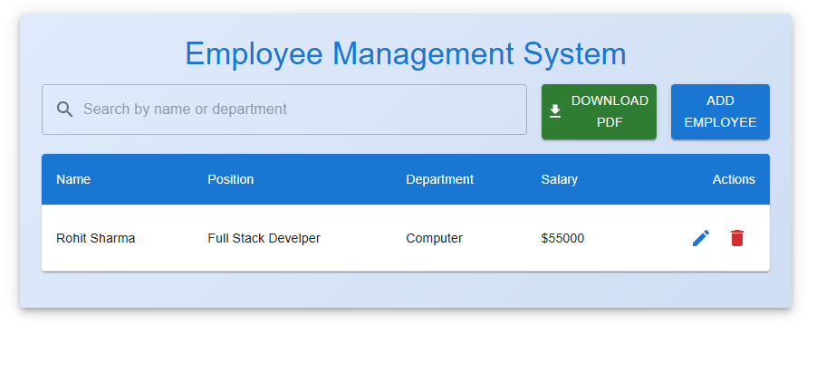

# Employee Management System

This project is an Employee Management System built using TypeScript, Express.js, and React. It provides a set of functionalities to manage employee records, including creating, retrieving, updating, and deleting employee information.

## Features

- Create new employee records
- Retrieve employee details
- Update existing employee information
- Delete employee records
- **Modern colorful UI with gradient background**
- **Search/filter employees by name or department**
- **Download employee list as PDF**
- **Snackbar notifications for actions**
- Organized structure with controllers, models, and routes

## Project Structure

```
employee-management-system
├── src
│   ├── app.ts                # Entry point of the application
│   ├── controllers           # Contains the employee controller
│   │   └── employeeController.ts
│   ├── models                # Contains the employee model
│   │   └── employee.ts
│   ├── routes                # Contains the employee routes
│   │   └── employeeRoutes.ts
│   └── types                 # Contains TypeScript types
│       └── index.ts
├── frontend                  # React frontend with colorful UI
│   └── src
│       └── App.js
├── package.json              # NPM configuration file
├── tsconfig.json             # TypeScript configuration file
└── README.md                 # Project documentation
```

## Installation

1. Clone the repository:
   ```
   git clone <repository-url>
   ```
2. Navigate to the project directory:
   ```
   cd employee-management-system
   ```
3. Install the dependencies:
   ```
   npm install
   ```

## Usage

To start the application, run:
```
npm start
```

The application will be available at `http://localhost:3000`.

## Contributing

Contributions are welcome! Please open an issue or submit a pull request for any improvements or features.

## License

This project is licensed under the MIT License.

## 🖼️ Project Preview


